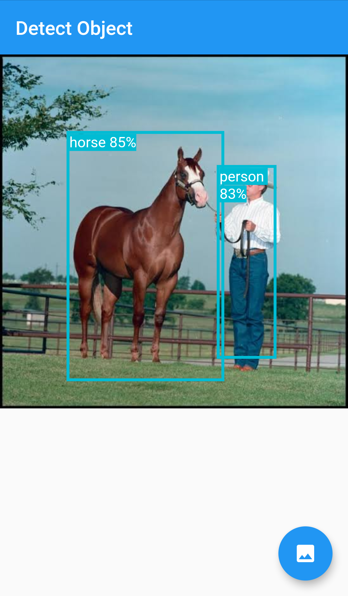
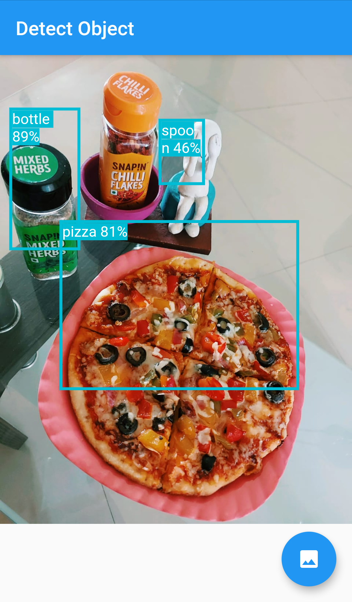

# Detect Object

A Simple Cross Platform Flutter Application for Image classification and Detecting Objects in images using Tensorflow Lite.
A Flutter plugin for accessing TensorFlow Lite API. Supports image classification, object detection (SSD and YOLO), Pix2Pix and Deeplab and PoseNet on both iOS and Android.

## Sample Images

 | 


## Installation

Add tflite as a dependency in your pubspec.yaml file.

### Android
In ```android/app/build.gradle```, add the following setting in ```android``` block.
```
    aaptOptions {
        noCompress 'tflite'
        noCompress 'lite'
    }
 ```
### iOS
Solutions to build errors on iOS:
- 'vector' file not found"

Open ```ios/Runner.xcworkspace``` in Xcode, click Runner > Tagets > Runner > Build Settings, search ```Compile Sources As```, change the value to ```Objective-C++```

- 'tensorflow/lite/kernels/register.h' file not found

The plugin assumes the tensorflow header files are located in path "tensorflow/lite/kernels".

However, for early versions of tensorflow the header path is "tensorflow/contrib/lite/kernels".

Use ```CONTRIB_PATH``` to toggle the path. Uncomment ```//#define CONTRIB_PATH``` from here:        [https://github.com/shaqian/flutter_tflite/blob/master/ios/Classes/TflitePlugin.mm#L1](https://github.com/shaqian/flutter_tflite/blob/master/ios/Classes/TflitePlugin.mm#L1) 
